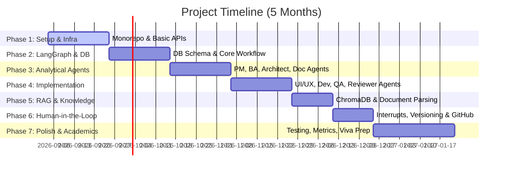

# AI Software Development Team — 5-Month Project Roadmap

This document outlines a structured, phase-by-phase timeline to build the **AI Software Development Team** platform. The roadmap is designed to build a solid, functional end-to-end MVP first (Months 1–3) before layering on complex features like RAG, advanced visual monitoring, and GitHub integration (Months 4–5).

---

## Roadmap Overview

---

## Detailed Timeline & Weekly Deliverables

### Phase 1: System Infrastructure & Workspace Setup
**Timeline:** Weeks 1–3 (Month 1)
**Goal:** Establish the monorepo, service communication protocols, and basic authentication.

*   **Week 1: Project Scaffolding**
    *   Set up monorepo directories: `apps/web` (Next.js), `apps/api` (NestJS), and `apps/ai-service` (FastAPI).
    *   Initialize Docker Compose for local development (PostgreSQL, Redis, ChromaDB).
    *   Configure shared TypeScript configs, ESLint, and Prettier.
*   **Week 2: Database Setup & User Auth**
    *   Establish database connection in NestJS using Prisma/TypeORM.
    *   Implement user authentication (JWT-based login, signup, session management).
    *   Set up basic project CRUD APIs in NestJS.
*   **Week 3: Service-to-Service Communication**
    *   Set up FastAPI server structure.
    *   Establish communication between NestJS and FastAPI (HTTP REST Client + WebSocket boilerplate for real-time log streaming).
    *   Conduct end-to-end ping testing between Next.js -> NestJS -> FastAPI.

---

### Phase 2: Relational Database Schema & LangGraph Foundations
**Timeline:** Weeks 4–6 (Month 1–2)
**Goal:** Implement the database models to track agent execution states and write the first simple LangGraph.

*   **Week 4: Schema Design**
    *   Create Postgres schemas for:
        *   `Projects`: Metadata, configuration, technology choices.
        *   `AgentRuns`: Track individual execution history, duration, inputs, and outputs.
        *   `Artifacts`: Markdown/Code snippets produced by agents, including version tracking (`version_number`, `parent_id`).
        *   `HumanApprovals`: Statuses of approvals (`PENDING`, `APPROVED`, `REJECTED`, `REVISION_REQUESTED`).
*   **Week 5: LangGraph Architecture**
    *   Design the `TeamState` object in Python to hold runtime workspace details.
    *   Define a basic sequential graph structure: `ProjectManagerNode -> BusinessAnalystNode -> ReviewerNode`.
    *   Configure the LangGraph memory saver (in-memory or Redis checkpointer) to persist graph states.
*   **Week 6: Basic Graph Execution & Streaming**
    *   Expose endpoints in FastAPI to start a graph run.
    *   Stream running agent statuses (e.g., `"Project Manager is thinking..."`) from FastAPI to NestJS and out to Next.js via WebSockets/Server-Sent Events (SSE).

---

### Phase 3: Developing Core Analytical Agents
**Timeline:** Weeks 7–9 (Month 2–3)
**Goal:** Implement the business planning agents and refine their prompts using Gemini.

*   **Week 7: Project Manager Agent (PMA)**
    *   Engineer prompts for the Project Manager agent.
    *   Define input (user description) and output schema (JSON specifying scope, milestones, complexity estimation, risks).
    *   Configure structured JSON parsing using Gemini’s schema enforcement.
*   **Week 8: Business Analyst Agent (BAA)**
    *   Engineer BAA prompts to transform PMA's scope into detailed requirements.
    *   Generate functional requirements, non-functional requirements, and detailed user stories.
    *   Establish verification logic to ensure the BAA does not stray from the PMA's defined scope.
*   **Week 9: System Architect & Documentation Agents**
    *   System Architect: Generates recommended tech stacks, database schemas (in SQL/Markdown), and API designs (OpenAPI/Swagger specs).
    *   Documentation Agent: Builds a starting `README.md` and basic project setup instructions based on the architect's details.

---

### Phase 4: Implementation, QA & Reviewer Agents
**Timeline:** Weeks 10–12 (Month 3)
**Goal:** Complete the agent team, incorporating UI/UX concepts, QA code checking, and Tech Lead approval flows.

*   **Week 10: UI/UX & Developer Planning Agents**
    *   UI/UX Agent: Produces wireframe guides, component structures, screen flow diagrams (using Mermaid.js syntax).
    *   Dev Planner Agent: Maps out the directory structures, utility files, database models, and routes that need to be created.
*   **Week 11: QA Agent**
    *   Develop prompts for QA to scan the outputs of the Architect and Dev Planner.
    *   Generate test cases (unit test templates, endpoint testing plans) and edge cases.
    *   Implement bug detection logic: QA reviews the files and flags inconsistencies.
*   **Week 12: Reviewer / Tech Lead Agent**
    *   Orchestrate the Tech Lead agent to run evaluations on the collective artifacts.
    *   Design a conditional edge in LangGraph: if the Tech Lead approves, the graph completes; if they request revisions, direct execution back to the failing agent node with feedback logs.

---

### Phase 5: RAG & Knowledge Base Integration
**Timeline:** Weeks 13–14 (Month 4)
**Goal:** Allow users to upload PDFs and text files to serve as specialized context for the agents.

*   **Week 13: Document Processing & Embeddings**
    *   Set up a PDF/text parser in the NestJS backend to handle file uploads.
    *   Pass documents to FastAPI to chunk and generate embeddings (using Gemini Embeddings API).
    *   Ingest chunked vectors into ChromaDB, tagged with `project_id`.
*   **Week 14: Contextual Retrieval Querying**
    *   Create a custom tool in LangGraph that queries ChromaDB for relevant document chunks before invoking an agent's main prompt.
    *   Inject retrieved chunks as context (e.g., "Use these specific corporate coding standards during generation: ...").

---

### Phase 6: Human-in-the-Loop & Version Control Integration
**Timeline:** Weeks 15–16 (Month 4)
**Goal:** Pause the agent workflow for human approvals, support artifact version history, and introduce GitHub integration.

*   **Week 15: LangGraph Interruption & Dashboard Approvals**
    *   Implement LangGraph `interrupts` at key boundaries: after Architecture and after QA Review.
    *   Expose Next.js UI elements allowing the user to review the generated artifact, click "Approve", "Regenerate", or input "Reject with feedback: ...".
    *   Update PostgreSQL state records on approval events.
*   **Week 16: Output Versioning & GitHub API Integration**
    *   Build a comparison viewer in Next.js showing diffs between versions of an artifact (using packages like `diff-match-patch`).
    *   *(Advanced Feature)* Integrate octokit (GitHub API) in NestJS to:
        *   Optionally create a repository.
        *   Commit final generated code outlines and document files.
        *   Open pull requests with the generated documentation.

---

### Phase 7: Verification, Metric Evaluation & Academic Wrap-up
**Timeline:** Weeks 17–20 (Month 5)
**Goal:** Gather evaluations, optimize UI, deploy services, and write the project thesis.

*   **Week 17: End-to-End Testing & UI Polish**
    *   Conduct rigorous user flows: test project creation, approvals, rejects, and restarts.
    *   Refine dashboards, adding animations and styling to make the user experience premium.
    *   Ensure the React Flow visualization accurately displays active, completed, and pending stages.
*   **Week 18: Metric Collection**
    *   Measure response times, token usages, and agent success rates.
    *   Track manual vs. agent-driven generation times to gather statistics for your project report.
    *   Collect data on "Regeneration Rate" and "RAG Relevance scores".
*   **Week 19: Deployment**
    *   Deploy NestJS, PostgreSQL, Redis, and FastAPI to platforms like Render, Railway, or AWS.
    *   Deploy the Next.js Frontend to Vercel.
    *   Confirm cloud storage and environment variable configurations.
*   **Week 20: Documentation & Viva Preparation**
    *   Write the comprehensive project thesis paper (System architecture diagrams, data dictionaries, UML diagrams, evaluation charts).
    *   Prepare the final presentation slides and record a working video demo of the dashboard.
    *   Conduct mock Viva questions (e.g., "Why did you choose LangGraph over LangChain?", "How do you handle state persistence during human interrupts?").

---

## Key Academic Milestones

| Milestone | Expected Date | Deliverable Description |
| :--- | :--- | :--- |
| **M1: Architecture Approval** | Mid Month 1 | Complete directory scaffolding, database schema, and NestJS-FastAPI communication bridge. |
| **M2: Sequential Workflow MVP** | End Month 2 | A functional sequential workflow (PM -> BA -> Doc) producing simple text deliverables. |
| **M3: Full SDLC Multi-Agent Loop**| End Month 3 | Completed 9-agent graph including loops for Quality Assurance and Tech Lead reviews. |
| **M4: RAG & Human-in-the-Loop** | End Month 4 | ChromaDB document integration and functional "Pause/Resume" dashboard controls. |
| **M5: Final Deploy & Metrics** | End Month 5 | A live, deployed URL, measured performance metrics, and completed project thesis. |
